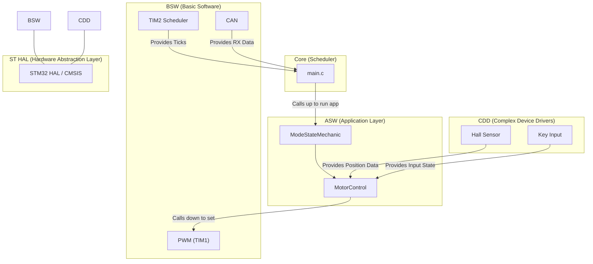
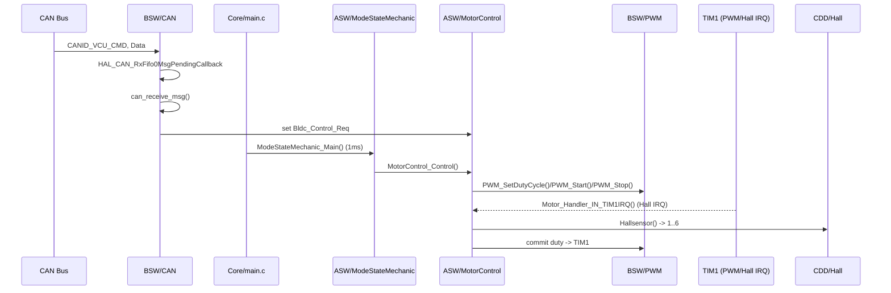

# 架构文档（中文版）

## 总览 🏗️

项目采用分层架构：

- Core：项目入口、系统时钟、ISR
- ASW（Application SW）：业务逻辑（ModeStateMechanic、MotorControl）
- BSW（Basic SW）：硬件抽象层（PWM、CAN、GPIO、TIM）
- CDD（Complex Device Driver）：设备驱动（Hall、Key）
- Drivers：STM32 HAL/CMSIS 原厂驱动

目录结构（主要文件）

- `Core/Src/main.c`：系统入口 + 主循环
- `ASW/ModeStateMechanic/*`：系统模式管理，模块生命周期
- `ASW/MotorControl/*`：电机驱动核心（初始化、控制、TIM1 IRQ 处理）
- `BSW/CAN/*`：CAN 报文发送/接收、过滤、解析
- `BSW/PWM/*`：TIM1 PWM 抽象（占空比设置）
- `BSW/TIM2/*`：TIM2 作为系统调度器，提供 Flag_1ms/10ms 等周期性标志
- `CDD/Hall/*`：霍尔传感器采集（IC/硬件相关）
- `CDD/KEY/*`：按键输入处理

## 模块职责

- ModeStateMechanic：
  - 管理系统模式（INIT/STANDBY/MOTORCTRL/SLEEP/FAILURE 等）
  - 使用 `MM_InitDeinit()` 统一管理模块 Init/Deinit
  - 提供 `ModeStateMechanic_Init()`、`ModeStateMechanic_Main()` 两个入口
- MotorControl：
  - 管理 `bldc_status` 状态、响应 `Bldc_Control_Req` 控制
  - 提供 `MotorControl_Init`/`MotorControl_DeInit`/`MotorControl_Control`/`Motor_Handler_IN_TIM1IRQ`
  - 使用 `PWM_SetDutyCycle` 控制 TIM1 占空比
  - 使用 `Hallsensor()` 读取霍尔
- CAN：
  - 初始化 CAN 外设，配置过滤器与中断
  - 处理接收回调 `HAL_CAN_RxFifo0MsgPendingCallback`，解包并写入 `Bldc_Control_Req`
  - 提供 `CAN1TX` 发送心跳/同步帧
- PWM：
  - PWM 初始化、开始/停止、占空比设置（`PWM_SetDutyCycle`）
- TIM2：
  - 定时中断，产生 `Flag_1ms/10ms/...`，被主循环读取
- Hall：
  - 将硬件霍尔信息包装为 `Hallsensor()`，返回 1..6 的电机相位

## 中断与调度模型

- TIM2（MX_TIM2_Init）用于周期性调度，产生 `Flag_1ms/10ms` 等；ISR 调用 `TIM2_Handler_IN_IRQ()`，将标志置位。
- TIM1 产生 PWM 及霍尔中断，ISR 调用 `Motor_Handler_IN_TIM1IRQ()`；该函数应尽量短暂，仅处理关键换相与状态更新
- HAL CAN 接收中断回调：`HAL_CAN_RxFifo0MsgPendingCallback` -> `can_receive_msg` -> `CAN_RX_Handle`（解析设置 `Bldc_Control_Req`）

## 通信与数据协议（CAN）

- CANID_VCU_CMD（0x000）: 控制指令
  - Data 帧格式（32位低位优先/按实现 - 这里基于 Data[0]）:
    - Bit 0: start_stop (1 启动, 0 停止)
    - Bit 1: CW_CCW (0 正转, 1 反转)
    - Bits [8..23]: pwm_duty（16位）
- CANID_SYNC（0x001）: 同步/心跳，`CAN1TX()` 发送固定 8 字节数据

## 生命周期管理

- `ModeStateMechanic` 使用 `MM_InitReq`, `MM_InitSts` 与 `MM_InitCfg[]` 管理每个模块的初始化/反初始化。
- 新模块：在 `ModeStateMechanic_InitTask.h` 中为该模块添加索引 (`MM_InitStsIndexes`) 并在 `ModeStateMechanic_InitTask.c` 中在 `MM_InitCfg` 中提供回调函数

## 硬件映射与资源分配

- TIM1: PWM 通道（CH1/CH2/CH3） -> `BSW/PWM` -> `htim1`
- TIM2: System scheduler -> `htim2` -> 1ms 触发
- CAN1: CAN 外设，滤波器 & 中断
- GPIO: LED、KEY、Shutdown 控制

---

## 可观测性与调试

- 定期发送心跳（`CAN1TX`）在 100ms 标志触发
- 500ms LED toggle 作为心跳可视化
- 在关键路径（`Motor_Handler_IN_TIM1IRQ`）可添加 `HAL_GPIO_TogglePin()` 用于示波器调试（示例已提供）

文档结束。

---

## 架构图（Mermaid） 🖼️

下面提供两张 mermaid 图：一张是系统总体架构，一张是常用控制流程（CAN 下发控制）示意。你可在支持 mermaid 的查看器中渲染。

整体模块架构（high-level）：

控制流程（CAN -> Motor control）:

